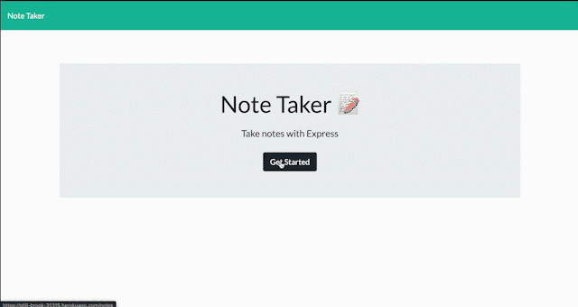

  # Note Taker

  ## Description
  Note Taker is a simple note taking app built with express.js that allows users to save, read and delete notes with a title and body. Front-end and JS functionality were created by Trilogy Education Services while I implemented express and handled routing to connect the front and back-end.

  
  ## Table of Contents
  * [Installation](#installation)
  * [Usage](#usage)
  * [Contributing](#contributing)
  * [Tests](#tests)
  * [Credits](#credits)
  * [License](#license)
  * [Questions](#questions)
  
  
  ## Installation
  No complicated installation, just go to link and start taking notes!
  
  
  ## Usage
  Note Taker is live [here](https://still-brook-31315.herokuapp.com/)

  
  
  
  ## Contributing
  There are currently no guidelines for contributing, fork and edit to your hearts content.
  
  
  ## Tests
  There are currently no tests for this app.
  

  ## Credits
  * [gmg300](https://github.com/gmg300)
  * Trilogy Education Services
  

        
  
  
  ## License
  

  Copyright &copy;2020 Garrett Gassensmith 
  
  
  ## Questions
  
  
  For questions or feedback email me at garrettgassensmith@gmail.com  
